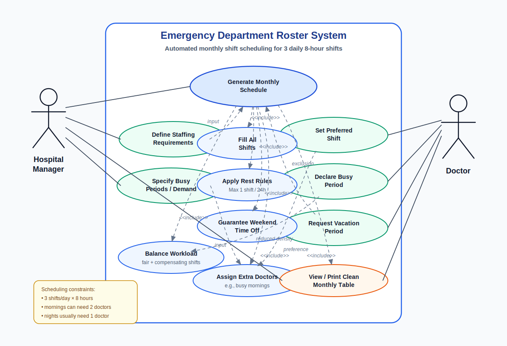

# Use Case Architecture and Detailed Use Cases

This includes a rudimentary use case diagram and a detailed use case in
standard format. The diagram is AI generated.

## UC-05: Generate Monthly Schedule

- **Primary Actor:** Hospital Emergency Department (ED) Manager
- **Description:** Outlines how an administrator triggers the system algorithm
  to compile doctor profiles, requests, and scheduling rules into an error-free
  monthly roster.
- **Preconditions:**
  1. The ED manager is securely authenticated and logged into the administrator
     account.
  1. Department-specific settings, such as weekend days and relative shift
     busyness, have been entered and stored in the database.
  1. Active doctors' details have been entered and are stored in the database.
  1. Shift preferences and vacation days have been submitted by each doctor for
     the target month and stored in the database.
- **Main Success Flow:**
  1. Manager clicks the "Schedule Generation Portal" tab on the admin panel.
  2. System displays a configuration view prompting for the target month and
     year.
  3. Manager selects the target month and clicks the "Generate Schedule"
     button.
  4. System pulls doctor profiles, vacation logs, and shift preferences from
     the database.
  5. System runs the scheduling algorithm, verifying that all shifts are
     filled, no doctor works back-to-back, and weekend allocations match system
     rules.
  6. System saves the finalized 30-day calendar into the database.
  7. System refreshes the user interface and displays the complete monthly
     roster grid.
- **Alternative Flows:**
  - Alt Flow 5a (Manual Adjustment Needed): If the algorithm detects that there
    are not enough available doctors to fill a specific shift due to
    overlapping vacations, the system stops execution, flags the conflict dates
    on screen, and prompts the Manager to manually assign an on-call doctor or
    override a vacation constraint.
- **Exceptions (Errors):**
  - Exception 4b (Data Failure): If communication with the database is lost
    during data retrieval, the system ceases generation, displays an error
    alert ("Database timeout. Schedule generation failed. Please try again."),
    and returns the Manager safely to the dashboard with no data saved.
- **Postconditions (Success Guarantee):**
  1. A complete, validated, 24/7 monthly shift roster is saved to the database.
  2. The web app updates to make the calendar viewable to all doctor profiles.
